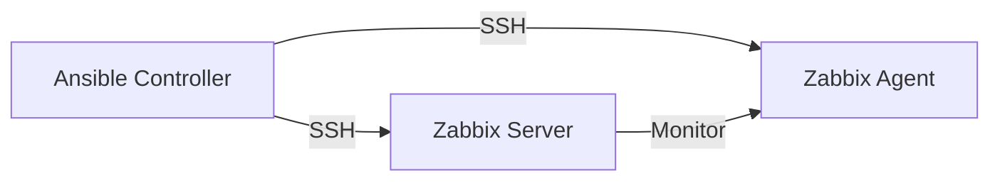
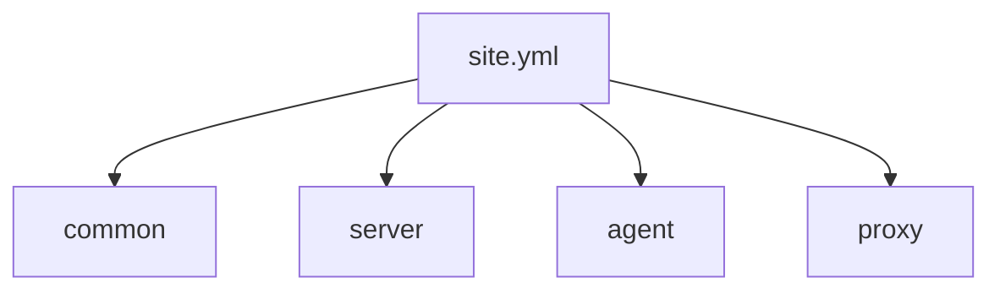
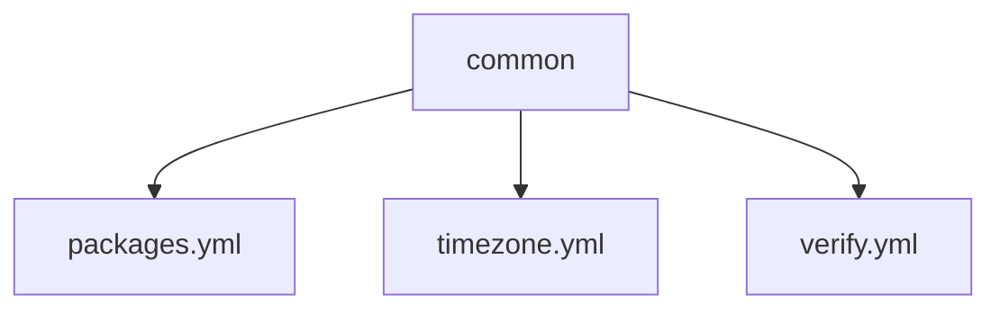

```mermaid
graph LR

A["Ansible Controller"]

B["Zabbix Server"]

C["Zabbix Agent"]

A -- SSH --> B

A -- SSH --> C

B -- Monitor --> C
```

```mermaid
graph TD

site.yml

site.yml --> common

site.yml --> server

site.yml --> agent

site.yml --> proxy
```

```mermaid
graph TD

common

common --> packages.yml

common --> timezone.yml

common --> verify.yml
```
```mermaid
graph TD

Inventory

↓

Gather Facts

↓

Common Role

↓

Packages

↓

Timezone

↓

Verification

↓

Play Recap
```
