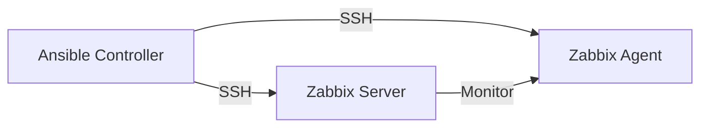
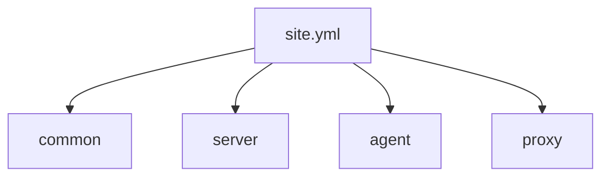
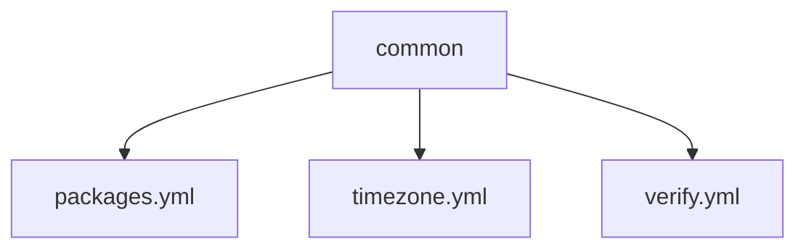
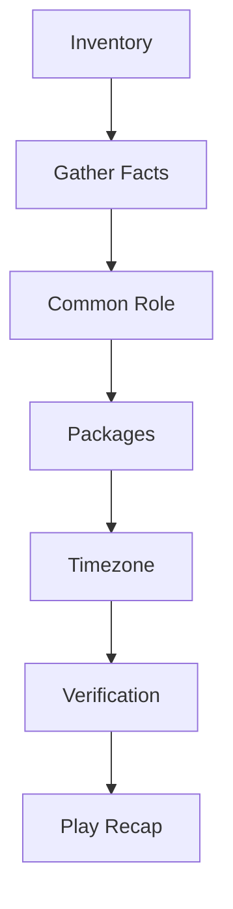
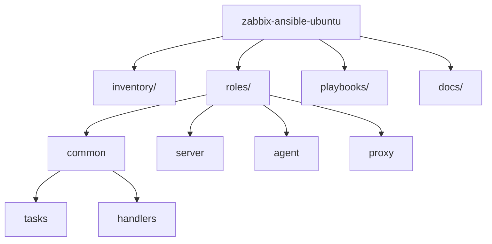
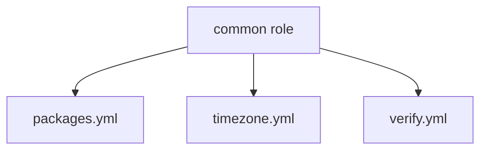
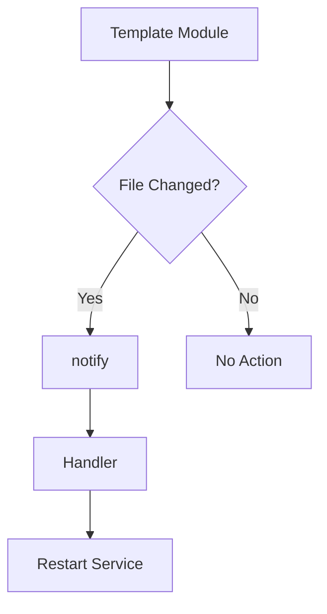

```mermaid
graph LR

A["Ansible Controller"]

B["Zabbix Server"]

C["Zabbix Agent"]

A -- SSH --> B

A -- SSH --> C

B -- Monitor --> C
```

```mermaid
graph TD

site.yml

site.yml --> common

site.yml --> server

site.yml --> agent

site.yml --> proxy
```

```mermaid
graph TD

common

common --> packages.yml

common --> timezone.yml

common --> verify.yml

```

```mermaid
graph TD
    A[Inventory]
    B[Gather Facts]
    C[Common Role]
    D[Packages]
    E[Timezone]
    F[Verification]
    G[Play Recap]

    A --> B
    B --> C
    C --> D
    D --> E
    E --> F
    F --> G
```

```mermaid
graph LR

Controller["Ansible Controller"]

Server["Zabbix Server"]

Agent["Zabbix Agent"]

Controller -->|SSH| Server
Controller -->|SSH| Agent

Server -->|Monitor| Agent
```

```mermaid
graph TD

Project["zabbix-ansible-ubuntu"]

Project --> Inventory["inventory/"]
Project --> Roles["roles/"]
Project --> Playbooks["playbooks/"]
Project --> Docs["docs/"]

Roles --> Common["common"]
Roles --> Server["server"]
Roles --> Agent["agent"]
Roles --> Proxy["proxy"]

Common --> Tasks["tasks"]
Common --> Handlers["handlers"]
```

```mermaid
graph TD

Common["common role"]

Common --> Packages["packages.yml"]
Common --> Timezone["timezone.yml"]
Common --> Verify["verify.yml"]
```

```mermaid
graph TD

Template["Template Module"]

Changed{"File Changed?"}

Notify["notify"]

Handler["Handler"]

Restart["Restart Service"]

Template --> Changed
Changed -->|Yes| Notify
Notify --> Handler
Handler --> Restart
Changed -->|No| End["No Action"]
```
